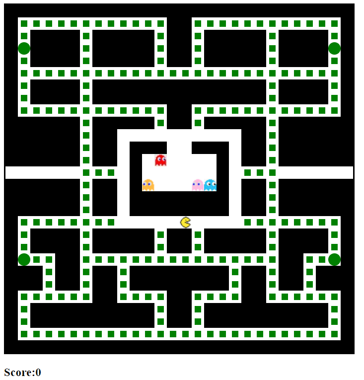

# pac-man

I built this because I wanted to practice vanilla Javascript while also doing a really cool project. I loved Pac-Man as a child and I wanted to see if I could re-create it. I also wanted to familiarize myself with constructor mehtods. Thank you to Ania Kubow for the Youtube tutorial.

# Environment Setup

1. Clone my repo at https://github.com/davidmstanleyjr/pac-man
2. CD into that directory and run it in your default browser.

# Technologies Used
1. HTML
2. CSS
3. Javascript
4. Favicon.io

# Issues

It was hard to get the timers to work and also to get the ghosts to move around. I wasn't using math.floor and math.floor correctly but once I figured it out, I was ok. I also had to pics of pac-man and the ghosts online and resize them, which took forever.

# Screenshots
